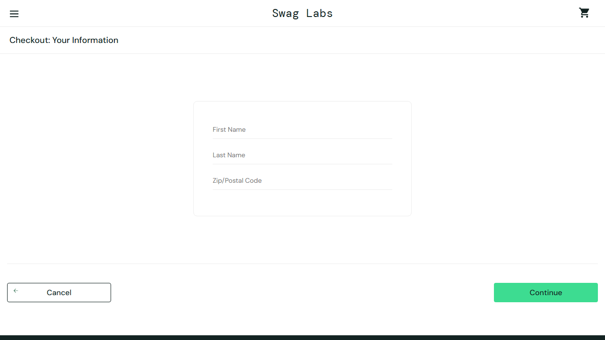

# BUG-001: System Allows Checkout with Empty Cart

## 🔴 Status: Open
**Severity:** High  
**Priority:** High  
**Reported Date:** May 11, 2026  
**Reporter:** Wissarut Nuamchum (Bank)

---

## 📝 Description
The system incorrectly allows users to proceed to the checkout process even when the shopping cart is empty. This violates the standard e-commerce checkout flow, which should require at least one item to proceed.

## 💻 Environment
- **Browsers:** Chromium, Firefox, Webkit (via Playwright)
- **URL:** [https://www.saucedemo.com/cart.html](https://www.saucedemo.com/cart.html)
- **Test User:** `standard_user`

---

## 👣 Steps to Reproduce
1. Login to the application using `standard_user`.
2. Ensure the shopping cart is empty.
3. Navigate to the Cart page by clicking the cart icon.
4. Click the **"Checkout"** button.

## ✅ Expected Result
- The system should display a warning message indicating that the cart is empty.
- Or, the **"Checkout"** button should be disabled until an item is added.

## ❌ Actual Result
- The system successfully redirects the user to the Checkout Information page (`checkout-step-one.html`) without any validation or warning.

---

## 🔍 Automated Verification
- **Test Case ID:** `TC-CART-003`
- **Automation Tool:** Playwright + TypeScript
- **Assertion:** `await expect(page).not.toHaveURL(/checkout-step-one.html/);`
- **Status:** Failed (The assertion failed as the system navigated to the checkout page).

---

## 📸 Evidence
- **Screenshot:** 
- **Test Case ID:** TC-CART-003 confirmed the bug via automated test